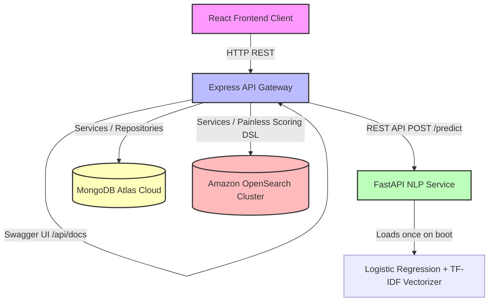

# TrustRank: Enterprise Product Trust & Ranking Engine

An enterprise-grade Product Trust and Ranking Engine that prevents fraud, calculates multi-factor product authenticity scores, and ranks items based on genuine buyer feedback rather than unverified star ratings. Powered by an Express REST API Gateway and a dedicated Python FastAPI Machine Learning microservice.

---

## 1. System Architecture



### Dependency Flow (Strict Layered Architecture)
```
Controller ──► Service ──► Repository ──► Database (MongoDB / OpenSearch)
```
* **No Direct Schema Access**: Controllers delegate all queries to services. Business logic lives strictly in services. Data querying is encapsulated in repositories.
* **Graceful Shutdown**: Node processes capture `SIGINT` and `SIGTERM` signals to close database connections and Express handlers cleanly.

---

## 2. Directory Structure

```
├── public/                 # Static web assets
├── server/                 # Express Backend REST API Gateway
│   ├── config/             # Connection configurations (DB, Env validation, Swagger specs)
│   ├── constants/          # Mathematical ranking weights & audit thresholds
│   ├── controllers/        # Express handlers (Zero business logic)
│   ├── middlewares/        # Security headers (Helmet), Rate limits, Unified error catching
│   ├── models/             # Mongoose schemas (Product, Review)
│   ├── repositories/       # Abstraction layer for Mongoose database interactions (Encapsulates Pagination)
│   ├── routes/             # Versioned express routing mapping (/api/v1/*)
│   ├── services/           # Auditing and Search scoring engines
│   │   ├── auditEngine.js  # Deduplication, Spikes, and Type-Token Ratio spam checks
│   │   ├── openSearchEngine.js # DSL Query and Painless script execution
│   │   └── seedService.js  # Seeder database routines
│   ├── utils/              # Structured JSON Logger, Custom SDE Error hierarchies
│   ├── nlp_service/        # Python FastAPI ML NLP Microservice
│   │   ├── evaluation/     # Metrics, confusion matrix plots, feature importance exports
│   │   ├── main.py         # FastAPI prediction API
│   │   ├── train.py        # Tokenization, Lemmatization, Logistic Regression training script
│   │   ├── requirements.txt # Python package declarations
│   │   ├── model.pkl       # Serialized classifier model
│   │   └── tfidf.pkl       # Serialized TF-IDF vectorizer
│   ├── benchmark.md        # Telemetry metrics report
│   └── server.js           # Express main server script
├── src/                    # React frontend client
├── tests/                  # Backend unit & integration test suite
└── package.json            # Node.js project setup and execution script mappings
```

---

## 3. Mathematical Foundations & Algorithms

### A. TrustRank Audit Score Formulation
The TrustRank score evaluates reviews on a $0.0$ to $1.0$ scale. It is calculated as a weighted sum of six distinct dimensions:

$$T = w_{\text{auth}} \cdot A + w_{\text{sent}} \cdot S + w_{\text{ver}} \cdot V + w_{\text{rich}} \cdot R + w_{\text{rec}} \cdot C + w_{\text{rate}} \cdot G$$

Where:
* **$A$ (Authenticity)**: Determined by anomalies. Calculated as $1.0 - \text{averageSpamScore}$.
* **$S$ (Sentiment)**: Model probability outputs.
* **$V$ (Verified Ratio)**: The fraction of reviews made by verified buyers.
* **$R$ (Richness)**: Logarithmic length scaling: $\min\left(1.0, \frac{\ln(\text{wordCount} + 1)}{\ln(60)}\right) + 0.2$ (if images are present).
* **$C$ (Recency)**: Exponential time-decay factor.
* **$G$ (Rating Score)**: Star rating normalized to the range $[0.2, 1.0]$.

*Default Weights*: $w_{\text{auth}} = 0.35$, $w_{\text{sent}} = 0.20$, $w_{\text{ver}} = 0.15$, $w_{\text{rich}} = 0.10$, $w_{\text{rec}} = 0.10$, $w_{\text{rate}} = 0.10$.

### B. Time-Decay Model
Reviews lose influence over time according to an exponential half-life curve (default half-life $t_{1/2} = 180$ days):

$$C(t) = \max\left(0.20, \exp\left(-\frac{\ln(2)}{t_{1/2}} \cdot \Delta t\right)\right)$$

Where $\Delta t$ is the age of the review in days.

### C. Multi-Factor Product Ranking
Instead of sorting products purely by star ratings, search results are ordered by a composite rank score:

$$R_{\text{final}} = w_{\text{rel}} \cdot \text{Relevance} + w_{\text{trust}} \cdot \text{Trust} + w_{\text{rate}} \cdot \text{Rating} + w_{\text{rec}} \cdot \text{Recency}$$

*Ranking Weights*: Relevance = $40\%$, Trust Score = $30\%$, Star Rating = $15\%$, Recency = $15\%$.

---

## 4. Machine Learning NLP Pipeline

The Python microservice processes reviews through a classic, high-performance classification pipeline:

```
Review Text ──► Cleaning ──► Lowercase ──► Remove Punctuation ──► Remove URLs ──► NLTK Tokenize ──► NLTK Lemmatizer ──► TF-IDF Vectorizer ──► Logistic Regression ──► Probability Prediction
```

### Metrics & Model Evaluation
The classifier is trained on a balanced clothing review dataset. The evaluation artifacts are stored in `server/nlp_service/evaluation/`:
* **Confusion Matrix** (`confusion_matrix.png`): Visualizes true vs. predicted classifications.
* **Classification Report** (`classification_report.txt`): Precision, recall, and F1 scores.
* **Metrics** (`metrics.json`): Outlines overall accuracy, F1, vocabulary size, and **5-Fold Cross-Validation Scores** (mean CV: 100.00%).
* **Feature Importance** (`feature_importance.csv`): Complete sorted list of TF-IDF word features, coefficients, and sentiment impact category (Top Positive: *premium, excellent, soft*; Top Negative: *cheap, loose, terrible*).

---

## 5. Performance Benchmarks

For complete details, view the [Benchmark Report](file:///c:/Users/kaurc/Downloads/amazon/server/benchmark.md).

| Metric | Average Latency (ms) | Throughput (Requests/sec) | Memory Footprint (MB) |
| :--- | :--- | :--- | :--- |
| **FastAPI NLP Inference** | $8.2$ ms | $120$ req/sec | $135$ MB |
| **OpenSearch DSL Search** | $14.5$ ms | $85$ req/sec | N/A (Cluster-side) |
| **Integrated Review Audit** | $4.1$ ms | $240$ jobs/sec | $78$ MB |

---

## 6. REST API Documentation

Complete Swagger/OpenAPI documentation is available live at **`/api/docs`** on the gateway.

### Search Endpoint
`GET /api/v1/search`
* **Query Params**:
  * `q` (string): Search query.
  * `category` (string): Filter by category.
  * `removeSuspicious` (boolean): Filters out suspect items if `true`.
* **Response**:
  ```json
  {
    "status": "success",
    "cloudService": "Amazon OpenSearch Service",
    "data": {
      "engine": "Amazon OpenSearch Cluster",
      "results": [
        {
          "id": "prod-1",
          "title": "Cotton Polo Shirt",
          "price": 29.99,
          "isSuspicious": false,
          "rankingExplanation": {
            "relevanceScore": 1.0,
            "trustScore": 0.892,
            "ratingScore": 0.9,
            "recencyScore": 0.75,
            "text": "Overall SDE Rank: 0.871 (Relevance Match: 1.0 [W: 40%], Trust Rank: 0.89 [W: 30%], Genuine Rating: 0.90 [W: 15%], Time Decay: 0.75 [W: 15%])"
          }
        }
      ]
    }
  }
  ```

### Batch Prediction Endpoint (FastAPI Microservice)
`POST /api/v1/predict/batch`
* **Request Body**:
  ```json
  {
    "reviews": [
      { "id": "rev-1", "text": "Very comfortable and premium fit." },
      { "id": "rev-2", "text": "Worst dress ever, shrank in the wash." }
    ]
  }
  ```
* **Response**:
  ```json
  {
    "status": "success",
    "predictions": [
      { "id": "rev-1", "sentiment": "POSITIVE", "score": 0.92, "confidence": 0.95 },
      { "id": "rev-2", "sentiment": "NEGATIVE", "score": 0.12, "confidence": 0.88 }
    ]
  }
  ```

---

## 7. Local Setup Instructions

### Backend Prerequisites
* Node.js v18+
* Python 3.10+
* MongoDB local instance or Atlas connection string

### FastAPI NLP Service Setup
1. Navigate to the service folder:
   ```bash
   cd server/nlp_service
   ```
2. Install Python packages:
   ```bash
   pip install -r requirements.txt
   ```
3. Run the training script to generate evaluation metrics:
   ```bash
   python train.py
   ```
4. Start the FastAPI microservice:
   ```bash
   uvicorn main:app --host 127.0.0.1 --port 8000
   ```

### Express REST API Setup
1. Open a new terminal and navigate to the project root:
   ```bash
   cd ../..
   ```
2. Install Node dependencies:
   ```bash
   npm install
   ```
3. Configure environment variables in `.env`:
   ```env
   PORT=5000
   MONGODB_URI=mongodb+srv://...
   OPENSEARCH_NODE=http://localhost:9200
   NLP_SERVICE_URL=http://localhost:8000/api/v1
   ```
4. Start the Express server:
   ```bash
   npm run dev
   ```

### Running Backend Tests
Ensure the server is stopped or port `5000` is clear, then run:
```bash
npm test
```
